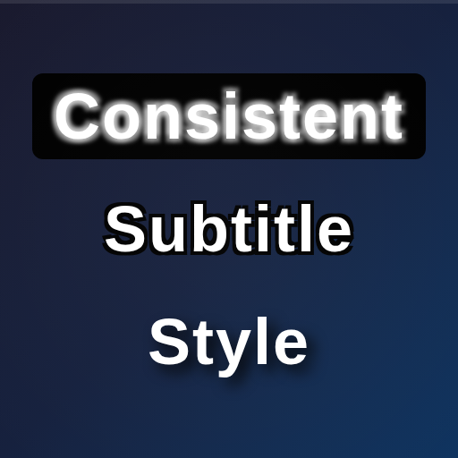

<p align="center">
  
</p>

## Overview

A Chrome extension that applies persistent, customizable subtitle styles across streaming platforms. Features a hybrid styling approach using native APIs where available (YouTube) with CSS injection fallback for other platforms. Currently supports **YouTube**, **Nebula**, **Dropout**, **Prime Video**, **Max (HBO Max)**, **Crunchyroll**, **Disney+**, **Netflix**, and **Vimeo**.

## Features

- **9 customizable style properties**: font color, font family, font size, font opacity, background color, background opacity, window color, window opacity, and character edge style
- **Per-site settings**: apply different styles to different platforms (or use one global style everywhere)
- **Per-setting scope control**: toggle each individual setting between global and per-site scope via scope chips
- **Preset system**: 3 built-in presets (Recommended, High Contrast, Do Nothing) plus custom user-created presets
- **Live preview**: see style changes in the popup before they're applied
- **Instant updates**: style changes apply immediately without reloading the page
- **Per-site override indicators**: amber dot badges on settings that differ from global, with SVG platform logos
- **Platform documentation**: in-extension ℹ️ info pages for each platform (approach, supported settings, limitations)
- **Keyboard navigation**: full keyboard support for dropdown menus (Arrow keys, Enter, Escape, ARIA)
- **Platform detection banner**: shows supported/unsupported status for current site
- **Import/Export**: backup and restore all settings as JSON with schema versioning

## Quick Start

### Installation

1. Build the extension:
   ```bash
   npm install
   npm run build
   ```
2. Load extension in Chrome:
   - Open Chrome
   - Go to `chrome://extensions/`
   - Enable "Developer mode"
   - Click "Load unpacked"
   - Select the `dist/` folder (not the source directory)

### Usage

1. Navigate to any supported streaming service
2. Click the extension icon to open settings
3. Customize your subtitle styles (or pick a preset)
4. Styles persist across all videos and platforms
5. Use the scope toggle to apply settings globally or per-site

## Supported Platforms

| Platform      | Status | Support Type                                         |
| ------------- | ------ | ---------------------------------------------------- |
| YouTube       | ✅     | Native API                                           |
| Nebula        | ✅     | CSS injection                                        |
| Dropout       | ✅     | Hybrid (Vimeo Player + inline styles + localStorage) |
| Prime Video   | ✅     | CSS injection (11 regional Amazon domains)           |
| Max (HBO Max) | ✅     | CSS injection (max.com + hbomax.com)                 |
| Crunchyroll   | ✅     | CSS injection (Bitmovin player)                      |
| Disney+       | ✅     | CSS injection + Shadow DOM (disney-web-player)       |
| Netflix       | ✅     | CSS injection (Cadmium player-timedtext)             |
| Vimeo         | ✅     | CSS injection (vp-captions, embedded player)         |

### Dropout / VHX

Dropout uses a Vimeo OTT player embedded in a cross-origin iframe (`embed.vhx.tv`). Because `chrome.storage.onChanged` doesn't fire inside cross-origin iframes, the extension uses a multi-layered approach to apply and persist subtitle styles:

1. **Inline styles** — The primary mechanism for live visual updates. The extension directly sets inline CSS on the Vimeo caption DOM elements (`.vp-captions` container, `CaptionsRenderer_module_captionsLine` spans, and `CaptionsRenderer_module_captionsWindow`), mirroring how the Vimeo player's own Customize UI works internally.

2. **localStorage sync** — Writes style values to all known Vimeo settings keys (`vimeo-ott-player-settings`, `vimeo-video-settings`, etc.) in snake_case format so they persist across reloads.

3. **Vimeo Player API** — When available, calls `setCaptionStyle()` on the Vimeo player instance. The extension uses an aggressive discovery strategy (global scans, React Fiber traversal, Video.js wrappers) to locate the player object, with a `postMessage` fallback if the API isn't directly accessible.

4. **`broadcastChanges`** — Since the parent page (`dropout.tv`) receives `chrome.storage.onChanged` events but the Vimeo iframe does not, the extension's injection script on the parent page forwards setting changes into the iframe via `postMessage`.

### Prime Video

Uses CSS injection targeting Amazon's `atvwebplayersdk` subtitle selectors. Supports 11 regional Amazon domains (.com, .co.uk, .de, .co.jp, .fr, .it, .es, .in, .ca, .com.au, .com.br).

### Max (HBO Max)

Uses CSS injection targeting Max's `CaptionWindow`, `TextCue`, and `CueBoxContainer` selectors. Supports both max.com and legacy hbomax.com domains.

### Crunchyroll

Uses CSS injection targeting Crunchyroll's Bitmovin player subtitle selectors (`bmpui-ui-subtitle-label` and `bmpui-ui-subtitle-overlay`). CSS-only approach — no native API integration needed.

### Disney+

Uses CSS injection targeting Disney+'s subtitle renderers (`dss-subtitle-renderer-cue` and `hive-subtitle-renderer-cue`). Disney+ renders its player inside a `<disney-web-player>` custom element with Shadow DOM, so the extension injects styles into both the document and the shadow root. A MutationObserver watches for the shadow host element to appear and re-injects styles when the player loads.

### Netflix

Uses CSS injection targeting Netflix's Cadmium player subtitle elements (`player-timedtext-text-container` for text containers and `player-timedtext` for the overlay). Netflix applies heavy inline styles to subtitles, but CSS rules with `!important` override them. Note: image-based subtitles (used for some languages like Japanese) are rendered as SVG bitmaps and cannot be restyled with CSS.

## Development

```bash
npm install          # Install dependencies
npm run build        # Development build
npm run build:prod   # Production build
npm run test         # Run unit tests (913 tests)
npm run ci           # Full CI: format + lint + typecheck + test + build
npm run release      # Build production zip for CWS submission
npm run build:firefox   # Production build with Firefox manifest
npm run release:firefox # Build Firefox release zip for AMO submission
```

### Testing

- **Unit tests**: 913 tests across 25 test files (Vitest)
- **E2E tests**: 350+ assertions across all 9 platforms + presets + per-site settings (Puppeteer, 11 E2E suites)

```bash
npm run test         # Unit tests
bash e2e/run.sh      # E2E tests (requires Chrome)
```

## Architecture

```
src/
├── main.ts          # Content script: style application engine
├── injection.ts     # Content script: bridge between extension and page
├── bridge.ts        # Injected into page: fake chrome.storage API
├── background.ts    # Service worker: dynamic content script registration
├── css-mappings.ts  # CSS property/value mappings for all settings
├── storage.ts       # Settings persistence (chrome.storage.sync)
├── site-settings.ts # Per-site settings CRUD
├── presets.ts       # Built-in preset definitions
├── custom-presets.ts# Custom preset save/load/delete
├── settings-io.ts   # Import/export settings (JSON backup/restore)
├── platform-docs.ts # Per-platform documentation data
├── platform-icons.ts# SVG platform logo components
├── platforms/       # Platform-specific handlers
│   ├── index.ts     # Platform detection and config registry
│   ├── youtube.ts   # YouTube native API integration
│   ├── nebula.ts    # Nebula CSS selectors
│   ├── dropout.ts   # Dropout/VHX/Vimeo hybrid handler
│   ├── primevideo.ts# Prime Video CSS selectors
│   ├── max.ts       # Max (HBO Max) CSS selectors
│   ├── crunchyroll.ts# Crunchyroll Bitmovin CSS selectors
│   ├── disneyplus.ts# Disney+ CSS selectors + Shadow DOM
│   ├── netflix.ts   # Netflix Cadmium player-timedtext selectors
│   └── vimeo.ts     # Vimeo vp-captions CSS selectors
├── types/           # TypeScript type definitions
└── ui/
    ├── popup.ts     # Popup UI logic (settings, presets, custom presets, per-site, scope chips)
    ├── styles.css   # Popup styles (dark theme)
    └── index.html   # Popup HTML shell
```
